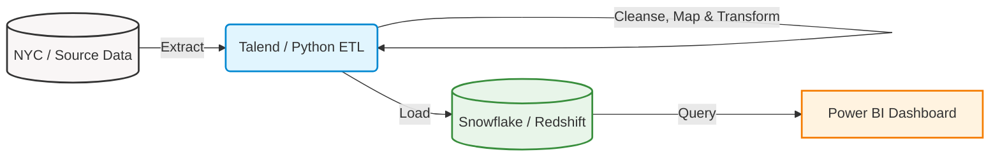

# Case Study: Architecting Public Safety Analytics

## 1. Background: The Context
Los Angeles is a sprawling, dynamic metropolis with a complex socioeconomic fabric. Managing public safety across its diverse neighborhoods requires more than just intuition; it requires precision, speed, and facts. For law enforcement agencies and city planners, the sheer volume and velocity of crime data present a significant challenge. 

**The core problem:** How do we transition from reactive policing to proactive, data-driven decision-making? Raw data exists in abundance, but without a structured, analytical backbone, allocating resources effectively and understanding true ground-level trends remains a guessing game. 

This project bridges that gap by transforming fragmented data into an actionable intelligence hub.

---

## 2. Key Insights
By rigorously processing the raw data and developing the analytical dashboard, we surfaced several critical trends that directly impact operational strategy:

- **Geospatial Hotspots:** Crime is not evenly distributed. Deep geospatial tagging (Lat/Lon mapping) reveals distinct clusters, allowing for targeted patrol deployments rather than uniform resource spread.
- **Temporal Patterns:** Significant spikes in specific offenses (like Burglary or Motor Vehicle Theft) align closely with particular time windows, enabling shift optimizations for law enforcement personnel.
- **Demographic Vulnerabilities:** Analysis of victim profiles (Age, Descent, Sex) exposes disproportionately affected demographics, heavily informing community outreach and preventative policies.
- **Modus Operandi & Weapons:** By categorizing over a hundred precise crime codes and weapon descriptions, we gained clarity on *how* crimes are being committed, guiding specialized task force training.

---

## 3. The Challenge of Reality: Navigating Data Complexity
True data transformation is rarely clean. The primary challenge in this initiative was the extreme complexity and obfuscation present in the original dataset. 

**Mapping the Unknown:** 
Raw crime records utilize deeply clinical and often cryptic categorization systems (e.g., granular "Crm Cd", "Mocodes", and "Premis Cd"). Building a meaningful dashboard required us to first act as domain experts—reading through extensive data dictionaries to understand exactly how officers record offenses on the street. 

**Translating Knowledge into the ETL Pipeline:** 
We used these semantic learnings to programmatically power our ETL script (`main.py`). The script represents a massive mapping effort:
- **Consolidation:** We mapped over 100 disparate Crime Codes (e.g., standardizing codes `435`, `436`, `622` all into *Simple Assaults* and translating `210`, `220` into *Robbery*).
- **Cleansing & Imputation:** Addressed missing describer values—handling unknown victim descents, cleaning up weapon codes to default logical states (`No/UNKNOWN WEAPON`), and translating obscure Premise Codes into readable formats like *Single-Family House* or *Apartment*.
- **Temporal Transformation:** Converted raw, often messy text-based military times into standardized 12-hour datetime objects for clear BI consumption.

By hard-coding these business rules into our Python ETL pipeline, we ensured that the resulting data warehouse receives only high-fidelity, analysis-ready information.

---

## 4. Technical Architecture
To handle this scale, we designed a resilient, automated data pipeline. As requested, the architecture seamlessly moves data from the source, transforms it, loads it into a robust data warehouse, and finally feeds a dynamic BI layer.

1. **Source Data:** Initiated from raw, tabular data files (NYC Data / Open records).
2. **ETL Processing:** Facilitated through **Talend** acting as the orchestrator, utilizing our custom Python scripts for complex data mapping, cleansing, and type-casting.
3. **Data Warehouse:** The processed facts and dimensions are loaded into **Snowflake / Amazon Redshift**, optimized for rapid analytical querying.
4. **Analytics Layer:** **Power BI** connects directly to the warehouse to power the interactive data visualizations provided in the `.pbix` deliverable.

---

## 5. Executive Presentation
![First Slide: Presentation.pptx](

